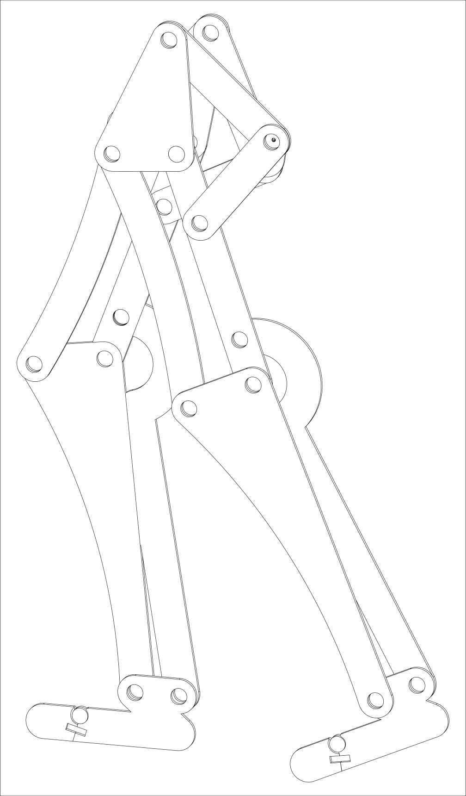
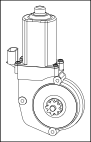
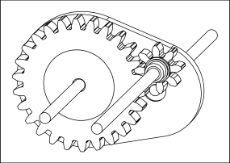

# testLeg
Simulated human leg providing repeatable, consistent walking motion for simulation and improvement of assistive wearable devices.

_Note: Set your github theme to light mode to be able to see the vector diagrams._

## Converting kinematic motion of human walking pattern into linkage-based mechanism 

## Linkage-based mechanism with both legs assembled

## Rotational movement source (12VDC automotive window motor)

## Rotational movement gearbox for reduction to realistic walking speed

## Rotational movement gearbox interfaced with linkage-based mechanism

## Video of simulated human leg evaluation of speed and angular velocity in SOLIDWORKS
https://github.com/myleskeller/testLeg/assets/43857093/b65f960c-8dda-40f3-9a87-0620db16bb4b
